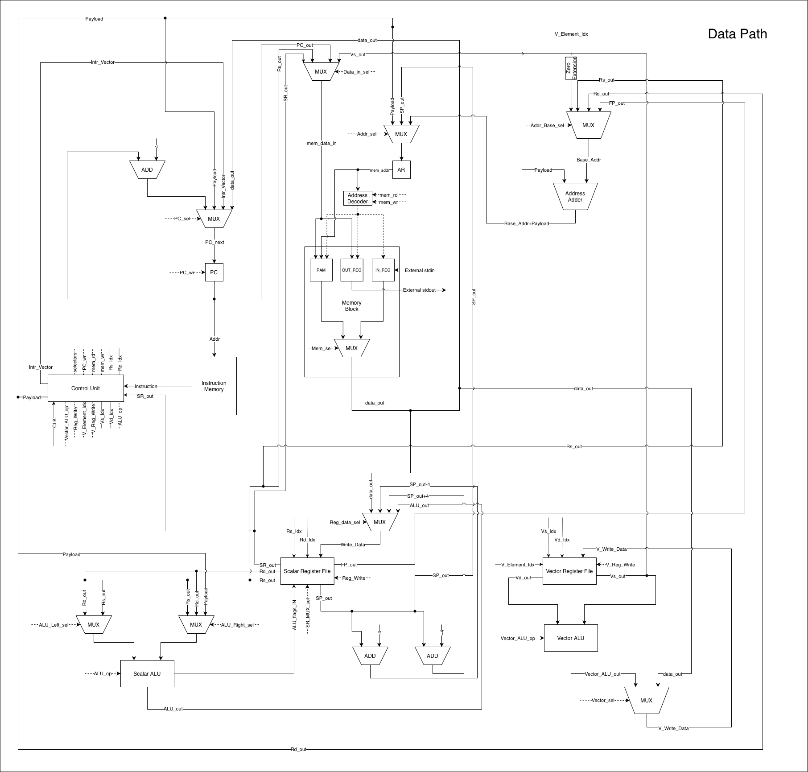
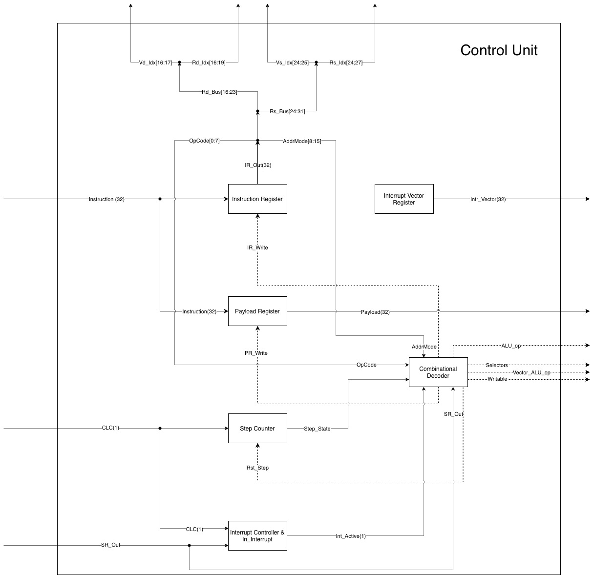
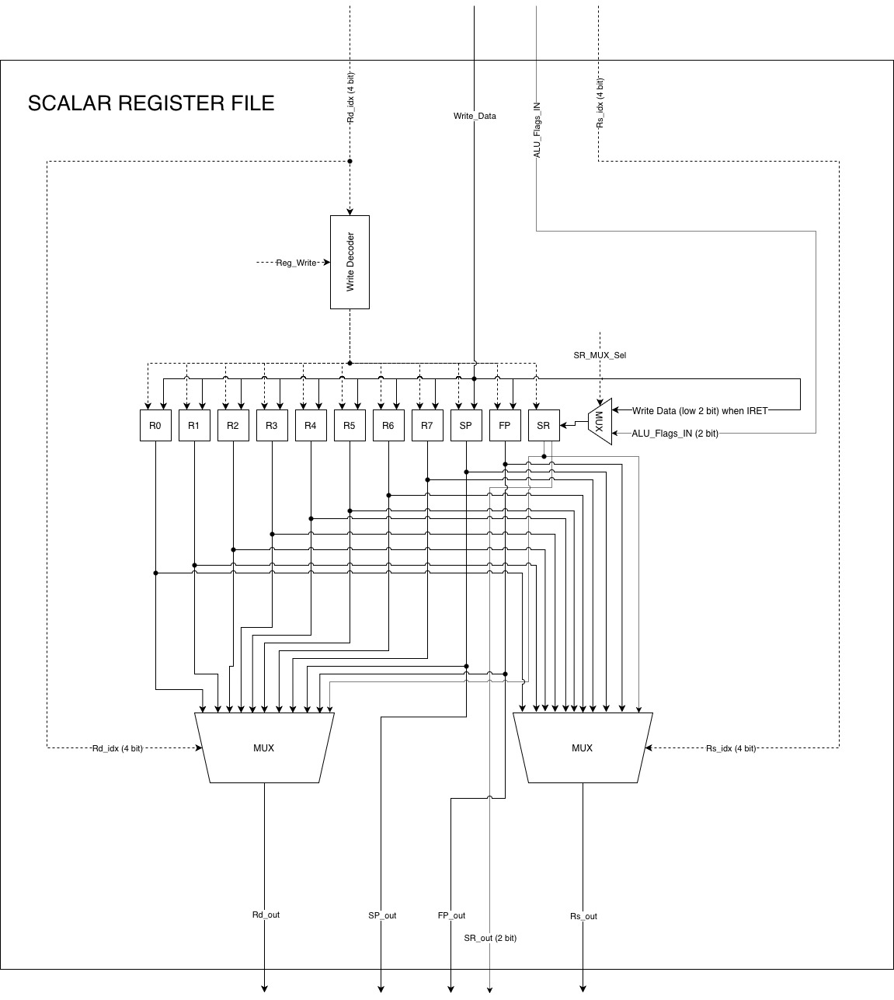
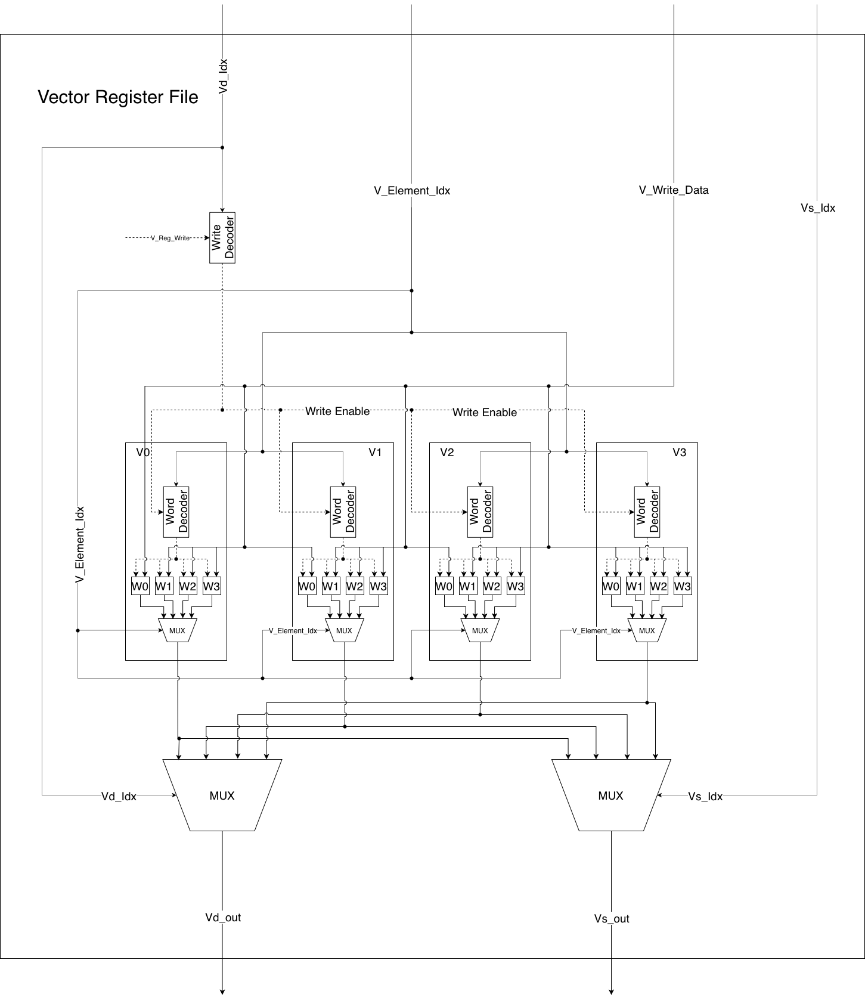

# Лабораторная работа №4. Эксперимент

* **ФИО:** Разгоняев Максим Витальевич
* **Группа:** P3231
* **Вариант:** `lisp | cisc | harv | hw | tick | binary | trap | mem | cstr | prob1 | vector`

---

## Содержание

1. [Особенности реализации варианта](#особенности-реализации-варианта)
    * [Язык программирования](#1-язык-программирования-lisp)
    * [Система команд](#2-система-команд-cisc)
    * [Архитектура организации памяти](#3-архитектура-организации-памяти-harv)
    * [Управляющее устройство](#4-управляющее-устройство-hw)
    * [Точность моделирования](#5-точность-моделирования-tick)
    * [Представление машинного кода](#6-представление-машинного-кода-binary)
    * [Ввод-вывод](#7-ввод-вывод-trap)
    * [Ввод-вывод ISA](#8-ввод-вывод-isa-mem)
    * [Поддержка строк](#9-поддержка-строк-cstr)
    * [Алгоритм](#10-алгоритм-prob1)
    * [Усложнение](#11-усложнение-vector)
2. [Язык программирования](#язык-программирования)
    * [Описание синтаксиса (BNF)](#формальная-бэкуса-наура-bnf-грамматика)
    * [Семантика языка](#семантика-языка)
3. [Организация памяти и жизненный цикл сущностей](#организация-памяти-и-жизненный-цикл-сущностей)
    * [Литералы](#1-литералы-literals)
    * [Константы](#2-константы-constants)
    * [Переменные](#3-переменные-variables)
    * [Инструкции](#4-инструкции-instructions)
    * [Процедуры](#5-процедуры-procedures--functions)
    * [Прерывания](#6-прерывания-interrupts)
4. [Система команд (ISA)](#система-команд-isa)
    * [Особенности архитектуры процессора](#1-особенности-архитектуры-процессора)
        * [Типы данных и машинных слов](#типы-данных-и-машинных-слов)
        * [Устройство регистров](#устройство-регистров)
        * [Режимы адресации](#режимы-адресации)
        * [Устройство ввода-вывода](#устройство-ввода-вывода-mmio)
        * [Поток управления и система прерываний](#поток-управления-и-система-прерываний-trap)
    * [Описание кодирования инструкций](#2-описание-кодирования-инструкций)
    * [Классификация системы команд](#3-классификация-системы-команд)
    * [Набор инструкций и такты выполнения](#4-набор-инструкций-и-такты-выполнения)
    * [Потактовое выполнение инструкций](#5-потактовое-выполнение-инструкций-takt-by-takt)
5. [Транслятор](#транслятор)
    * [Интерфейс командной строки](#1-интерфейс-командной-строки-cli)
    * [Принципы и этапы работы транслятора](#2-принципы-и-этапы-работы-транслятора)
        * [Токенизация](#этап-1-токенизация)
        * [Построение абстрактного синтаксического дерева](#этап-2-построение-ast-parsing)
        * [Первый проход компиляции](#этап-3-первый-проход-компиляции)
        * [Второй проход компиляции](#этап-4-второй-проход-компиляции)
        * [Сериализация и вывод](#этап-5-сериализация-и-вывод)
6. [Модель процессора](#модель-процессора)
    * [Интерфейс командной строки](#1-интерфейс-командной-строки-cli-1)
    * [Описание регистров, флагов и сигналов](#2-описание-регистров-флагов-и-сигналов)
        * [Аппаратные флаги состояния](#аппаратные-флаги-состояния-sr)
        * [Аппаратные управляющие сигналы](#аппаратные-управляющие-сигналы-control-signals)
    * [Особенности реализации процесса моделирования](#3-особенности-реализации-процесса-моделирования)
    * [Схемы процессора и их описание](#4-схемы-процессора-и-их-описание)
        * [Схема 1: Глобальный тракт данных процессора (DataPath)](#схема-1-глобальный-тракт-данных-процессора-datapath)
        * [Схема 2: Внутреннее устройство Управляющего Устройства (Control Unit)](#схема-2-внутреннее-устройство-управляющего-устройства-control-unit)
        * [Схема 3: Внутренняя структура скалярного регистрового файла (Scalar Register File)](#схема-3-внутренняя-структура-скалярного-регистрового-файла-scalar-register-file)
        * [Схема 4: Внутренняя структура векторного регистрового файла (Vector Register File)](#схема-4-внутренняя-структура-векторного-регистрового-файла-vector-register-file)
7. [Тестирование](#тестирование)
    * [Краткое описание разработанных тестов](#1-краткое-описание-разработанных-тестов)
    * [Golden-тесты реализованных алгоритмов](#2-golden-тесты-реализованных-алгоритмов)
    * [Пример использования разработанной инструментальной цепочки](#3-пример-использования-разработанной-инструментальной-цепочки)

## Особенности реализации варианта

### 1. Язык программирования (`lisp`)

* **Требование варианта:** Синтаксис языка Lisp (S-выражения). Требуется поддержка рекурсивных функций. Любое
  выражение (statement) должно являться выражением (expression), возвращающим значение.
* **Особенности реализации:**
    * **Концепция «Всё есть выражение»:** В трансляторе `src/translator.py` абсолютно любая синтаксическая конструкция
      возвращает вычисленный результат в регистр-аккумулятор `R0`. Операция присваивания `(setq x 10)` не просто
      записывает `10` в память, но и оставляет `10` в `R0`. Благодаря этому полностью валидны вложенные конструкции вида
      `(print (if (= x 0) "T" "F"))`.
    * **Поддержка рекурсии через аппаратный стек:** Рекурсивные вызовы реализованы по классической схеме стековых
      фреймов с использованием регистра `FP` (Frame Pointer). При компиляции `defun` транслятор автоматически
      генерирует пролог:
        1. `PUSH FP` - сохранение указателя кадра вызывающей функции на стек.
        2. `MOV FP, SP` - создание границы нового кадра.
           Локальные аргументы функции адресуются относительно `FP` со смещением (первый аргумент находится по адресу
           `[FP + 8]`, второй - `[FP + 12]` и т.д.). При возврате выполняется эпилог: восстанавливается `SP = FP`,
           извлекается старый `FP` (`POP FP`), и выполняется `RET`, что полностью изолирует локальные переменные
           рекурсивных вызовов.

---

### 2. Система команд (`cisc`)

* **Требование варианта:** Наличие сложных инструкций, работающих с регистрами и памятью
  за одну операцию. Работа со специальными регистрами. Переменная длина команд и считывание нескольких машинных слов при
  выборке.
* **Особенности реализации:**
    * **Переменная длина инструкций:** Инструкции кодируются заголовком (4 байта) и опциональным Payload (4 байта).
      Выборка команды в `ControlUnit` происходит в два этапа: сначала считывается заголовок (4 байта), определяется
      режим адресации. Если режим требует наличия payload (`IMMEDIATE`, `DIRECT`, `INDIRECT`), CU явно считывает
      следующие 4 байта из памяти команд (`struct.unpack('<I',...)`), сдвигая `PC` на 8 байт вместо 4.
    * **Работа со специальными регистрами:** Регистры `SP`, `FP`, `SR` и `PC` интегрированы напрямую в систему команд.
      Команды `CALL` и `RET`/`IRET` аппаратно взаимодействуют со стеком вызовов (меняя `SP`), а `CMP` обновляет биты
      флагов в `SR` (Bit 0 = ZF, Bit 1 = NF).
    * **Сложные операции за один такт:** Команды работы с памятью `LOAD` и `STORE` умеют вычислять адреса на лету с
      использованием косвенной адресации со смещением (`[reg + offset]`), выполняя сложение базового адреса и константы
      payload на аппаратном уровне.

---

### 3. Архитектура организации памяти (`harv`)

* **Требование варианта:** Гарвардская архитектура (раздельная память команд и данных). В тестах необходимо
  привести/проверить как память команд, так и память данных.
* **Особенности реализации:**
    * **Физическое разделение:** Память команд `instruction_memory` (в виде байтовой строки `bytes`) и память данных
      `data_memory` (список целых чисел `list[int]`) полностью изолированы друг от друга в классе `DataPath`.
      Процессор физически не может исполнить команду из ОЗУ данных или записать данные в память команд.
    * **Интеграционный дамп для тестов:** В симуляторе реализован метод `dump_memories()`, который вызывается при
      остановке процессора (`HALT`) и выводит в лог раздельные отформатированные таблицы содержимого памяти
      команд (с HEX-кодами и исходным Lisp-кодом) и памяти данных (с метками STACK и STATIC/GLOBAL)

---

### 4. Управляющее устройство (`hw`)

* **Требование варианта:** Жесткая логика управления (Hardwired Control Unit).
* **Особенности реализации:**
    * **Аппаратный декодер команд:** Модель `ControlUnit` не содержит памяти микропрограмм и словарей микроинструкций (
      что характерно для микрокода `mc`). Логика переходов конечного автомата запрограммирована аппаратно в виде
      методов-исполнителей (`_execute_mov`, `_execute_add` и т.д.). Декодирование опкода напрямую активирует
      соответствующий управляющий метод, эмулируя прохождение сигналов дешифратора к блокам `DataPath`.

---

### 5. Точность моделирования (`tick`)

* **Требование варианта:** Моделирование процессора с точностью до такта (`tick`).
* **Особенности реализации:**
    * **Потактовый симулятор:** Счетчик тактов `self.tick_count` инкрементируется при каждом элементарном действии
      процессора. Чтение заголовка команды из памяти команд занимает 1 такт, чтение payload - еще 1 такт, выполнение
      базовой операции в ALU - 1 такт. Операции работы с памятью (`LOAD`/`STORE`) тратят дополнительно 1 такт на
      обращение к ОЗУ. Векторные операции последовательно тратят по 1 такту на каждый обрабатываемый элемент (всего
      `VECTOR_SIZE` такта - задается в isa).

---

### 6. Представление машинного кода (`binary`)

* **Требование варианта:** Настоящие бинарные файлы. Требуется отладочный вывод в текстовый файл вида
  `<address> - <HEXCODE> - <mnemonic>`.
* **Особенности реализации:**
    * **Бинарный формат:** Выходной файл транслятора `<program>.bin` является чистым бинарным файлом. Он упакован в
      беззнаковый формат Little-Endian (`struct.pack('<I',...)`) и снабжен 12-байтовым заголовком секций.
    * **Отладочный текстовый дамп:** Компилятор при сборке генерирует текстовый файл `<program>.bin.txt`, в котором для
      каждой инструкции рассчитывается её точный байтовый адрес в Instruction Memory, выводится её шестнадцатеричный
      дамп (HEX-code) и восстанавливается стандартная ассемблерная мнемоника. Файл заполняется в формате
      `<address> - <HEXCODE> - <mnemonnic>`.

---

### 7. Ввод-вывод (`trap`)

* **Требование варианта:** Ввод-вывод осуществляется токенами через систему прерываний (расписание прерываний по
  тактам).
* **Особенности реализации:**
    * **Асинхронный контроллер прерываний:** Реализован в `check_interrupt_schedule`. На определенном такте симулятор
      приостанавливает выполнение фонового цикла, заносит `PC` и `SR` на стек и переходит к обработчику.
    * **Автоматическое сохранение контекста в Lisp:** Для исключения искажения регистров (Register Corruption), когда
      прерывание срабатывает между вычислением условия и ветвлением в основном цикле, транслятор при компиляции
      `definterrupt` автоматически генерирует команды сохранения контекста `PUSH R0`, `PUSH R1` на входе и
      восстановления `POP R1`, `POP R0` на выходе перед вызовом команды возврата `IRET`.
    * **Реализм вложенности:** Если во время выполнения обработчика прерывания (`in_interrupt = True`) наступает такт
      другого запланированного прерывания, оно откладывается до тех пор, пока текущий обработчик не завершится вызовом
      `IRET`.

---

### 8. Ввод-вывод ISA (`mem`)

* **Требование варианта:** Memory-Mapped I/O (порты ввода-вывода отображаются в память и доступ к ним осуществляется
  штатными командами).
* **Особенности реализации:**
    * **Отображение на пространство памяти:** Адреса портов зарезервированы: `0xFF00` - `stdin` и `0xFF01` - `stdout`.
    * **Аппаратный перехват:** При вызове команд чтения (`LOAD`) или записи (`STORE`) по этим адресам, тракт данных
      `DataPath` перехватывает обращения и перенаправляет их в изолированные буферы симулятора (`input_buffer`/
      `output_buffer`), не затрагивая ячейки оперативной памяти данных, что полностью соответствует концепции MMIO.

---

### 9. Поддержка строк (`cstr`)

* **Требование варианта:** Null-terminated C-style строки.
* **Особенности реализации:**
    * **Словесная упаковка:** Строковые литералы преобразуются транслятором в последовательность кодов символов, где
      каждый символ занимает одно машинное слово (32 бита) в секции статических данных ОЗУ, и завершается нулем.
    * **Печать строк:** Системный вызов `INT 2` принимает адрес начала строки в `R0` и посимвольно выводит ее,
      инкрементируя адрес на 1 слово, пока не встретит нуль-терминатор.
    * **Парсер чисел `read-int`:** На языке Lisp написана функция `read-int`, которая посимвольно читает из `stdin`
      ASCII-символы-цифры (от `48` до `57`), отбрасывает пробелы и собирает из них полноценные многозначные целые числа
      по формуле `val = val * 10 + (char - 48)`, обеспечивая прозрачную работу со строковым вводом.

---

### 10. Алгоритм (`prob1`)

* **Постановка задачи:**
  Палиндромом называется число, которое читается одинаково в обоих направлениях. Наибольший палиндром, полученный
  произведением двух двузначных чисел, равен $9009 = 91 \times 99$. Найдите наибольший палиндром, полученный
  произведением двух трехзначных чисел.
* **Исходный код:** `examples/prob1.lisp`
* **Архитектурные и алгоритмические оптимизации (для обхода лимита тактов):**
  Прямой перебор во вложенных циклах от `100` до `999` требует 405_000 итераций. С учетом потактовой эмуляции
  работы аппаратуры (создание стековых кадров `FP`, проверка условий цикла, математика ALU) один вызов проверки на
  палиндромность занимает около 1000 тактов. Наивный алгоритм потребовал бы более 60_000_000 тактов, что
  привело бы к аварийному завершению симулятора по лимиту времени.
  Для достижения мгновенного выполнения в рамках жестких физических ограничений процессора применены две
  оптимизации:
    1. **Инлайнинг Modulo (Inlining):** Встроенная функция `mod` заменена на встраиваемое арифметическое выражение
       остатка `(- n (* 10 (/ n 10)))`. Это исключило регулярное забивание стека кадрами `FP`, вызовы `CALL`/`RET` и
       сэкономило около 300 тактов на каждую проверку разряда.
    2. **Обратный поиск с отсечением ветвей:**
        * Поиск сомножителей `i` и `j` идет в обратном направлении - от `999` вниз до `100`.
        * Инициализация максимума `max_pal` значением `900000` (так как искомый палиндром заведомо
          больше $900 \times 900 = 810\,000$) позволяет внутреннему циклу `while (< max_pal (* i j))` мгновенно отсекать
          `j` на первых же итерациях.
        * **Досрочный останов внешнего цикла:** Как только произведение `i * 999 <= max_pal`, внешний цикл принудительно
          останавливается. Так как при меньших `i` произведение с любым `j` гарантированно будет меньше уже
          найденного максимума. Это сократило количество шагов внешнего цикла с `900` до `92` (
          программа останавливается на `i = 907`).

---

### 11. Усложнение (`vector`)

* **Требование варианта:** Векторная организация работы процессора (регистры и команды, минимальный набор операций:
  vadd, vsub, vmul, vdiv, vcmp, оценка эффективности).
* **Особенности реализации:**
    * **Аппаратная поддержка:** Реализовано 4 векторных регистра `V0-V3` по 4 элемента в каждом (задается константно в
      isa). Векторное ALU параллельно вычисляет операции над элементами, затрачивая по 1 такту на элемент
      (всего `VECTOR_SIZE` такта).
    * **Набор команд:** В транслятор и симулятор добавлены команды `vload` (загрузка массива в регистр за 6 тактов),
      `vstore` (сохранение регистра в память за 6 тактов), `vadd`, `vsub`, `vmul`, `vdiv`, `vcmp` (поэлементные
      математика и сравнение векторов за 5 тактов).
    * **Эффективность векторизации:** Сложение 4-х элементов с помощью векторных команд занимает всего 23 такта, в
      то время как эквивалентный скалярный цикл на Lisp требует 104 такта (ускорение в ~4.5 раза). Это
      достигается за счет полного устранения накладных расходов на условные переходы, инкременты индексов цикла и
      динамический расчет адресов в памяти.

Рассмотрим, сколько тактов процессора уходит на сложение 4-х элементов в обоих случаях:

| Этап / Инструкция                                                            | 	Скалярная реализация (на 1 итерацию)                                                                                 | 	Скалярная реализация (всего 4 итерации) | 	Векторная реализация (SIMD)                                            |
|------------------------------------------------------------------------------|-----------------------------------------------------------------------------------------------------------------------|------------------------------------------|-------------------------------------------------------------------------|
| Вычисление условия цикла  (i < 4)                                            | LOAD i (3) + PUSH R0 (3) + MOV R0, 4 (3) + POP R1 (3) + CMP R1, R0 (2) + JZ end_lbl (3) = 17 тактов                   | 17 * 4 = 68 тактов                       | Не требуется (нет цикла)                                                |
| Вычисление адресов и загрузка операндов  (load (+ 200 i)) и (load (+ 300 i)) | Расчет адресов 200 + i и 300 + i (сложение, временные пуши/попы) + 2x LOAD = 37 тактов                                | 37 * 4 = 148 тактов                      | VLOAD V0 200 + VLOAD V1 300 = 12 тактов (по 6 тактов на команду)        |
| Сложение элементов в ALU  (+ val_a val_b)                                    | POP R1 (3) + ADD R0, R1 (2) = 5 тактов                                                                                | 5 * 4 = 20 тактов                        | VADD V0 V1 = 5 тактов (1 на декодирование + 4 на поэлементное сложение) |
| Сохранение в память  (store (+ 400 i) result)                                | PUSH R0 (3) + MOV (3) + PUSH (3) + LOAD (3) + POP (3) + ADD (2) + MOV (2) + POP (3) + STORE косвенный (3) = 25 тактов | 25 * 4 = 100 такта                       | VSTORE 400 V0 = 6 тактов (1 на декодирование + 4 на запись + 1 payload) |
| Инкремент счетчика и переход  (setq i (+ i 1)) + JMP                         | LOAD (3) + PUSH (3) + MOV (3) + POP (3) + ADD (2) + STORE (3) + JMP (3) = 20 тактов                                   | 20 * 4 = 80 тактов                       | Не требуется                                                            |
| ИТОГО:                                                                       | 104 тактов                                                                                                            | 416 такта                                | 23 такта                                                                |

---

## Язык программирования

Разработанный язык программирования представляет собой упрощенный Lisp-подобный диалект, базирующийся на S-выражениях.
Ключевым свойством языка является семантика "всё есть выражение" (любая конструкция возвращает вычисленное значение), а
также поддержка рекурсивных функций и аппаратной обработки асинхронных прерываний.

### Формальная Бэкуса-Наура (BNF) грамматика

```bnf
<program> ::= <expression>*

<expression> ::= <literal>
               | <symbol>
               | <special_form>
               | "(" <operator> <expression> <expression> ")"
               | "(" <symbol> <expression>* ")"

<special_form> ::= "(" "setq" <symbol> <expression> ")"
                 | "(" "if" <expression> <expression> <expression> ")"
                 | "(" "while" <expression> <expression>+ ")"
                 | "(" "defun" <symbol> "(" <args> ")" <expression>+ ")"
                 | "(" "definterrupt" <symbol> <expression>+ ")"
                 | "(" "begin" <expression>+ ")"
                 | "(" "progn" <expression>+ ")"
                 | "(" "print" <expression> ")"
                 | "(" "print-str" <expression> ")"
                 | "(" "load" <expression> ")"
                 | "(" "store" <expression> <expression> ")"
                 | "(" "vload" <vector_register> <expression> ")"
                 | "(" "vstore" <expression> <vector_register> ")"
                 | "(" <vector_operator> <vector_register> <vector_register> ")"

<operator> ::= "+" | "-" | "*" | "/" | "=" | "<"

<vector_operator> ::= "vadd" | "vsub" | "vmul" | "vdiv" | "vcmp"

<vector_register> ::= "V0" | "V1" | "V2" | "V3"

<args> ::= <symbol>*

<literal> ::= <integer> | <string>
<integer> ::= [0-9]+
<string>  ::= '"' [^"]* '"'
<symbol>  ::= [a-zA-Z_][a-zA-Z0-9_-]*
```

### Семантика языка

* **Стратегия вычислений:** Аппликативный порядок вычислений (Eager Evaluation) - аргументы вычисляются рекурсивно до
  вызова тела функции. Передача параметров в подпрограммы осуществляется исключительно по значению.
* **Области видимости:**
    * *Глобальная область:* Объявляется на верхнем уровне через оператор `setq`. Глобальные переменные доступны во всем
      коде программы.
    * *Локальная область:* Параметры функций, объявленные в `defun`, локализованы внутри кадра стека текущего вызова
      функции. Поиск переменной сначала происходит во фрейме локальных переменных, а затем (если не найдено) в
      глобальной таблице символов.
* **Типизация:** Динамическая (утиная). Поддерживаются 32-битные целые беззнаковые числа (`0`–`4294967295`) и C-style
  строки (`cstr`), завершающиеся нуль-терминатором `\0`.
* **Особые управляющие конструкции:**
    * `begin` / `progn` - выполняют последовательность выражений и возвращают значение последнего из них.
    * `definterrupt` - специализированная конструкция для создания аппаратных обработчиков прерываний без накладных
      расходов на создание кадра стека `FP`.

---

## Организация памяти

Процессор реализует классическую **Гарвардскую архитектуру** с физически разделенной памятью команд и данных.

### Модель памяти и регистров

* **Память команд (Instruction Memory):** Объём - 4096 ячеек. Адресуется в байтах. Содержит скомпилированные
  CISC-инструкции переменной длины. Начиная с адреса `12` (так как первые 12 байт бинарника зарезервированы под
  заголовок секций `(Code Size (4B) + Data Size (4B) + Interrupt Vector (4B))`) хранятся тела пользовательских функций и
  основной программы.
* **Память данных (Data Memory):** Объём - 4096 слов. Адресуется в машинных словах (каждое слово - 32 бита). Разделена
  на три области:
    1. *Секция статических строк:* Начинается с адреса `0` и заполняется транслируемыми строковыми литералами.
    2. *Секция глобальных переменных:* Заполняется транслятором последовательно вслед за строковыми литералами.
    3. *Кадр аппаратного стека (Call Stack):* Расположен в конце памяти и растет вниз в направлении к адресу `0`.
       Вершина стека изначально установлена на адрес `4092`.
* **Регистровый файл:**
    * `R0` - Аккумулятор (регистр результатов выражений, через него возвращаются значения функций).
    * `R1` - Регистр промежуточных вычислений ALU.
    * `R2-R7` - Регистры общего назначения.
    * `V0-V3` - 4 векторных регистра (каждый хранит ровно 4 машинных слова).
    * `PC` (Program Counter) - указывает на байтовый адрес текущей выполняемой инструкции в памяти команд.
    * `SP` (Stack Pointer) - указывает на адрес текущей вершины стека в памяти данных.
    * `FP` (Frame Pointer) - указывает на начало кадра стека текущей функции, обеспечивая адресацию локальных
      переменных.
    * `SR` (Status Register) - содержит флаги состояния ALU: Bit 0 - флаг Zero (`ZF`), Bit 1 - флаг Negative (`NF`).

```text
     Instruction Memory (Память команд)
+------------------------------------------+
| 0000 : JMP start_of_main (Payload: 188)  | ; Обход обработчика при старте
| 0008 : interrupt_handler (IRET)          | ; Тело обработчика прерываний
|  ... : ...                               |
| 0188 : start_of_main: (LISP main program)| ; Код основной программы
|  ... : ...                               |
| 0224 : HALT                              | ; Точка останова
+------------------------------------------+

          Data Memory (Память данных)
+------------------------------------------+
| 0000 : "What is your name? " (cstr)      | ; Статическая строка в ОЗУ
| 0020 : Global Var "char"                 | ; Хранит последний символ ввода
| 0021 : Global Var "addr"                 | ; Указатель на буфер (105 / 'i')
| 0022 : "Hello, " (cstr)                  | ; Статическая строка в ОЗУ
| 0033 : "!" (cstr)                        | ; Статическая строка в ОЗУ
|  ... : ...                               |
| 0100 : Dynamic Input Buffer ("Maxim")    | ; Динамический буфер ввода
|  ... : ...                               |
| 4080 : Stack: [Saved FP (4092)]          | ; Сохраненный указатель кадра предыдущей функции (пример кадра стека при call)
| 4084 : Stack: [Return PC (208)]          | ; Адрес возврата PC в вызывающий код (на PC 208)
| 4088 : Stack: [arg1 (n = 5)]             | ; Локальный аргумент функции (переданный параметр n)
| 4092 : Stack: [0]                        | ; Вершина стека до вызова функций (Initial SP)
| 4093- : Stack: [0]                       | ; Неиспользуемая (чистая) зона стека
+------------------------------------------+
```

### Механика отображения данных на процессор

* **В каких случаях литерал используется при помощи непосредственной адресации?**
  Целочисленные литералы (например, `1000` в `(< i 1000)`) кодируются непосредственно внутри самой инструкции в памяти
  команд в виде 4-байтовой нагрузки (Payload). При вычислении процессор считывает это значение за один такт (
  `AddressingMode.IMMEDIATE`).
* **В каких случаях литерал сохраняется в статическую память данных?**
  Все строковые литералы (например, `"Hello"`) на этапе компиляции извлекаются из кода и помещаются в секцию статических
  данных ОЗУ, чтобы не перегружать память команд.
* **Как размещаются статические строки друг относительно друга?**
  Строки размещаются последовательно, начиная с адреса `0`. Каждая строка завершается ячейкой со значением `0` (
  null-terminator). Указатель `data_ptr` транслятора последовательно смещается на `len(string) + 1` слов для каждой
  следующей строки.
* **Как размещается в память строка (multi-word literal)?**
  Один символ строки занимает одно машинное слово (32 бита, Unicode/ASCII код). Символы последовательно записываются
  в ОЗУ слово за словом и завершаются нулем. Адрес начала этой строки загружается в `R0` командой
  `MOV R0, address`.
* **В каких случаях переменная отображается на регистр?**
  Ввиду отсутствия сложного оптимизирующего аллокатора регистров, переменные не сохраняются в регистрах общего
  назначения постоянно. Регистры `R0` и `R1` используются исключительно как транзитные временные буферы для вычисления
  выражений и выполнения операций ALU.
* **В каких случаях переменная отображается на статическую память данных?**
  Глобальные переменные (объявленные через `setq` на верхнем уровне) отображаются на фиксированные адреса памяти данных,
  начиная со свободной ячейки после статических строк. Они адресуются напрямую (`AddressingMode.DIRECT`).
* **В каких случаях переменная отображается на стек?**
  Локальные переменные (аргументы функций, переданные при `CALL`) отображаются на стек. Они адресуются через кадр
  стека относительно указателя `FP` со смещением (`AddressingMode.INDIRECT`, например, `LOAD R0, [FP + 8]`).

---

### Организация памяти и жизненный цикл сущностей

#### 1. Литералы (Literals)

Литералы представляют собой непосредственные значения (числа или строки), фиксированные на этапе написания кода.

* **Во время компиляции (Compile Time):**
    * *Числовые литералы:* Анализируются парсером и преобразуются в тип `int`. Транслятор кодирует их как
      непосредственное значение в теле инструкции (`AddressingMode.IMMEDIATE`) в виде 4-байтового Payload, следующего
      сразу за заголовком команды.
    * *Строковые литералы:* Обнаруживаются транслятором и извлекаются из кода. С помощью метода `allocate_string` они
      последовательно размещаются в секции статических данных ОЗУ, начиная с адреса `0`. Каждому символу выделяется
      ровно одно 32-битное машинное слово, в конец записывается `0` (null-terminator). Адрес начала этой строки в
      памяти данных возвращается в качестве константного Payload для инструкции `MOV R0, address`.
* **Во время исполнения (Runtime):**
    * *Числовые литералы:* Извлекаются процессором непосредственно из памяти команд в процессе фазы выборки инструкции (
      Fetch Payload) за один дополнительный такт.
    * *Строковые литералы:* Инструкция `MOV R0, address` загружает указатель на ячейку статических данных в регистр
      `R0`. Системный вызов печати `INT 2` (или функция `print-str`) потактово считывает слова из ОЗУ начиная с
      этого адреса, инкрементируя адрес на `1` (словесный шаг), пока не встретит терминатор `0`.

---

#### 2. Константы (Constants)

Константы в системе представляют собой предопределенные неизменяемые значения, используемые для конфигурации
оборудования (адреса портов ввода-вывода).

* **Во время компиляции (Compile Time):**
    * Адреса портов ввода-вывода зафиксированы в `src/isa.py` (`MMIO_INPUT = 0xFF00`, `MMIO_OUTPUT = 0xFF01`).
    * Транслятор импортирует эти константы и на этапе инициализации сопоставляет системным именам `"stdin"` и `"stdout"`
      в глобальной таблице символов (`self.symbol_table`).
    * Любое обращение к `"stdin"` или `"stdout"` транслируется в прямую адресацию памяти (`AddressingMode.DIRECT`) с
      Payload, равным значению соответствующего порта.
* **Во время исполнения (Runtime):**
    * Значения адресов портов считываются из памяти команд как Payload.
    * При выполнении инструкций `LOAD` или `STORE` по этим адресам тракт данных `DataPath` аппаратно перехватывает
      обращения и перенаправляет поток данных на шину ввода-вывода симулятора (MMIO), минуя физическое ОЗУ.

---

#### 3. Переменные (Variables)

Переменные делятся на глобальные (статические) и локальные (динамические).

* **Во время компиляции (Compile Time):**
    * *Глобальные переменные:* При встрече конструкции `(setq name val)` на верхнем уровне транслятор проверяет таблицу
      символов. Если имени `name` там нет, ему выделяется свободный индекс в ОЗУ данных (`self.data_ptr`), а
      `self.data_ptr` инкрементируется на 1 слово. Генерируется инструкция `STORE` с прямой адресацией (
      `AddressingMode.DIRECT`) по выделенному адресу.
    * *Локальные переменные (аргументы функций):* Регистрируются в локальном словаре аргументов текущей функции (
      `func_locals`) со смещением относительно кадра стека. Смещение рассчитывается по формуле:
      `offset = 8 + arg_idx * 4` (где `8` байт резервируются под сохраненный `FP` и `PC` в байтовой сетке стека).
      Для локальной записи генерируется косвенный `STORE` со смещением относительно `FP`.
* **Во время исполнения (Runtime):**
    * *Глобальные переменные:* Инструкции `LOAD R0, [addr]` и `STORE [addr], R0` напрямую считывают или записывают
      32-битное значение в выделенную статическую ячейку оперативной памяти данных.
    * *Локальные переменные:* Считываются и записываются аппаратно относительно регистра `FP` (Frame Pointer) по адресу
      `FP + offset` в памяти данных (стеке). При глубокой рекурсии новые вызовы создают новые стековые кадры.
      Каждому вызову соответствует свой физический адрес `FP`, что обеспечивает полную изоляцию и сохранность локальных
      данных разных вызовов.

---

#### 4. Инструкции (Instructions)

* **Во время компиляции (Compile Time):**
    * На первом проходе транслятор преобразует синтаксические ветви дерева AST (абстрактное синтаксическое дерево -
      система вложенных списков, которую генерирует `prarse_s_expression`) в промежуточные объекты `Instruction`.
    * На втором проходе транслятор кодирует каждую инструкцию: формирует 4-байтовый заголовок
      `[OpCode (1B)] [AddressingMode (1B)] [RegDest (1B)] [RegSrc (1B)]` и, если требуется, упаковывает 4-байтовый
      беззнаковый payload в Little-Endian (`<I`). Все байты последовательно пишутся в секцию кода бинарного
      файла.
* **Во время исполнения (Runtime):**
    * *Фаза выборки (Fetch):* Управляющее устройство считывает 4 байта инструкции из памяти команд по адресу `PC`,
      инкрементируя `PC` на 4.
    * *Фаза декодирования (Decode):* Анализируется `AddressingMode`. Если режим требует Payload, CU считывает еще 4
      байта из памяти команд, инкрементируя `PC` еще на 4 (итого длина команды - 8 байт).
    * *Фаза выполнения (Execute):* CU активирует соответствующую линию управления, перенаправляя выполнение в нужный
      аппаратный хендлер и тратя на это такты согласно спецификации команды.

---

#### 5. Процедуры (Procedures / Functions)

Процедуры объявляются через `defun` и поддерживают рекурсивные вызовы.

* **Во время компиляции (Compile Time):**
    * При встрече `(defun name (args) body...)` транслятор вставляет безусловный переход `JMP skip_lbl` для безопасного
      обхода тела функции при линейном исполнении.
    * Связывает метку `name` с текущим байтовым адресом начала функции в памяти команд.
    * Генерирует стандартный **пролог функции**: `PUSH FP` (сохранить старый frame-pointer) и `MOV FP, SP` (создать
      новый кадр).
    * Компилирует тело функции, используя локальный словарь смещений аргументов.
    * Генерирует стандартный **эпилог функции**: `MOV SP, FP` (сбросить локальные переменные), `POP FP` (восстановить
      старый frame-pointer) и команду возврата `RET`.
    * В месте вызова функции транслирует аргументы (кладет на стек) и генерирует `CALL name`. После возврата
      генерирует `ADD SP, len(args) * 4` для очистки аргументов со стека.
* **Во время исполнения (Runtime):**
    * Вызывающая сторона вычисляет аргументы и заносит их на стек с помощью `PUSH`.
    * Инструкция `CALL` помещает адрес следующей инструкции (`PC + 8`) на стек и меняет `PC` на адрес функции.
    * Процессор выполняет **пролог**: сохраняет старый `FP` на стек и устанавливает `FP = SP`. Локальные аргументы
      считываются по формуле `FP + 8`, `FP + 12` и т.д.
    * После выполнения тела процедуры процессор выполняет **эпилог**: восстанавливает `SP = FP` и `POP FP`.
    * Инструкция `RET` извлекает адрес возврата с вершины стека в `PC`. Вызывающая сторона аппаратно очищает стек от
      аргументов, восстанавливая исходный `SP`.

---

#### 6. Прерывания (Interrupts)

Прерывания представляют собой асинхронные события, обрабатываемые специализированными процедурами.

* **Во время компиляции (Compile Time):**
    * Конструкция `(definterrupt handler_name body...)` генерирует обход `JMP skip_lbl`.
    * Для максимального быстродействия **пролог и эпилог FP не создаются** (кадр стека не формируется).
    * В начале обработчика транслятор принудительно вставляет сохранение регистров `PUSH R0` и `PUSH R1` на стек, а в
      конце - их восстановление `POP R1` и `POP R0` для защиты контекста основной программы от искажения (Register
      Corruption).
    * Обработчик завершается специальной командой возврата из прерывания `IRET`.
    * Адрес начала функции `interrupt_handler` записывается транслятором в заголовок бинарного файла в поле *
      *`Interrupt Vector`** (смещение 8 в файле).
* **Во время исполнения (Runtime):**
    * При запуске симулятора адрес `Interrupt Vector` считывается из заголовка бинарника и защелкивается в специальный
      внутренний регистр CU `self.intr_vector`.
    * Перед выборкой каждой инструкции CU проверяет расписание прерываний. Если текущий такт совпадает с
      запланированным и процессор не находится в состоянии обработки прерывания (`in_interrupt == False`):
        1. Аппаратно сохраняет текущие `PC` и регистр флагов `SR` на стек.
        2. Устанавливает `in_interrupt = True`.
        3. Загружает в `PC` адрес из регистра `self.intr_vector`, мгновенно переключая контекст.
    * Внутри обработчика прерывания сохраняются и восстанавливаются регистры `R0`, `R1`.
    * Инструкция `IRET` восстанавливает регистр флагов `SR` и счетчик команд `PC` со стека, возвращая процессор к
      точному состоянию и месту основной программы, на котором она была прервана, и сбрасывает
      `in_interrupt = False`.

---

## Система команд (ISA)

### 1. Особенности архитектуры процессора

Процессор реализует классическую регистровую **CISC-архитектуру** с переменной длиной команд и Гарвардской организацией
памяти.

#### Типы данных и машинных слов

* **Машинное слово:** 32-битное (4 байта).
* **Основной тип данных:** Беззнаковое целое число в диапазоне от `0` до `4294967295 = 2^32 - 1` (представлено в формате
  Little-Endian).
* **Символьные данные (строки `cstr`):** Кодируются согласно таблице ASCII. Каждый символ физически занимает одно
  машинное слово (32 бита) в памяти данных. Строки завершаются нуль-терминатором `0`.
* **Векторные данные:** Обрабатываются пакетами по `VECTOR_SIZE` машинных слова.

#### Устройство регистров

В процессоре выделено 16 скалярных и 4 векторных регистра:

1. **Скалярные регистры общего назначения (`R0`-`R7`):**
    * `R0` (Accumulator) - главный транзитный регистр. Компилятор Lisp использует его для возврата результатов
      вычисления всех выражений.
    * `R1` (Scratch / Temp) - используется в качестве временного хранилища левого операнда при вычислении бинарных
      выражений ALU.
    * `R2-R7` - общего назначения (GP).
2. **Векторные регистры (`V0`-`V3`):** Каждая векторная сущность хранит массив из 4 независимых 32-битных слов.
3. **Специальные регистры:**
    * `PC` (Program Counter, `Reg 12`) - счетчик команд, хранит байтовый адрес выполняемой инструкции в памяти команд.
    * `SP` (Stack Pointer, `Reg 13`) - указатель вершины аппаратного стека в памяти данных.
    * `FP` (Frame Pointer, `Reg 14`) - указатель кадра стека подпрограммы; служит фиксированным якорем для
      стабильной относительной адресации локальных переменных и аргументов (например, [FP + 8]), независимо от
      постоянных перемещений указателя вершины стека SP.
    * `SR` (Status Register, `Reg 15`) - регистр флагов ALU:
        * `Bit 0` (Zero Flag, `ZF`): выставляется в 1, если результат операции равен 0.
        * `Bit 1` (Negative Flag, `NF`): выставляется в 1, если результат операции меньше 0 (произошел беззнаковый
          перенос).

#### Режимы адресации

* **`REGISTER` (0x01):** Операндом является значение регистра общего назначения.
* **`IMMEDIATE` (0x02):** Операнд является константой, извлекаемой непосредственно из Payload памяти команд.
* **`DIRECT` (0x03):** Операнд - ячейка памяти данных, адрес которой зафиксирован в Payload инструкции.
* **`INDIRECT` (0x04):** Косвенная регистровая адресация со смещением. Адрес ячейки вычисляется как
  `Base_Register + offset` (где `offset` берется из Payload). Используется для адресации локальных фреймов стека
  относительно `FP`.

#### Устройство ввода-вывода (MMIO)

Ввод-вывод реализован по схеме **Memory-Mapped I/O (MMIO)**. Выделенные порты проецируются на ячейки адресного
пространства ОЗУ данных:

* `0xFF00` - порт ввода (`stdin`).
* `0xFF01` - порт вывода (`stdout`).

Обращение к этим портам осуществляется штатными командами работы с памятью (`LOAD`/`STORE`), перехватывается трактом
данных на уровне шины ОЗУ и транслируется в текстовые потоки ввода-вывода симулятора.

#### Поток управления и система прерываний (TRAP)

* **Поток управления:** По умолчанию последовательный (увеличение `PC` на длину инструкции - 4 или 8 байт).
  Изменение `PC` происходит при вызове команд переходов (`JMP`, `JZ`, `JL`) или вызове функций (`CALL`, `RET`).
* **Система прерываний:** Аппаратный таймер проверяет планировщик `input_schedule`. На заданном такте процессор
  приостанавливает выполнение фоновой программы, сохраняет текущие `PC` и `SR` на стек и совершает переход по адресу,
  указанному в поле **`Interrupt Vector`** заголовка бинарного файла. Возврат в фоновую программу осуществляется по
  команде `IRET`. Прерывания не могут быть вложенными: если обработчик прерывания запущен, новые прерывания
  блокируются до вызова `IRET`.

---

### 2. Описание кодирования инструкций

Каждая CISC-инструкция имеет переменную длину (**4 или 8 байт**) и состоит из двух частей:

```text
|   Byte 0   |   Byte 1   |   Byte 2   |   Byte 3   |       Bytes 4-7 (Optional)       |
|   OpCode   |   AddrMode |   RegDest  |   RegSrc   |   32-bit Payload (Little-Endian) |
```

1. **Заголовок инструкции (Header, 4 байта):**
    * `Byte 0` (Bits 0–7): **OpCode** - код выполняемой операции (перечисление `OpCode`).
    * `Byte 1` (Bits 8–15): **AddressingMode** - режим адресации операндов (перечисление `AddressingMode`).
    * `Byte 2` (Bits 16–23): **RegDest (`Rd`)** - индекс целевого регистра или базового регистра для записи (целое число
      от `0` до `15`).
    * `Byte 3` (Bits 24–31): **RegSrc (`Rs`)** - индекс регистра-источника или базового регистра для чтения (целое число
      от `0` до `15`).
2. **Полезная нагрузка (Payload, 4 байта, опционально):**
    * Присутствует только тогда, когда `AddressingMode` равен `IMMEDIATE`, `DIRECT` или `INDIRECT`.
    * Записывается в формате **Unsigned 32-bit Little-Endian** (`<I` в `struct`). Хранит числовые константы,
      смещения или адреса памяти.

---

### 3. Классификация системы команд

На основе полученных характеристик разработанная система команд классифицируется как:

1. **CISC (Complex Instruction Set Computer):**
    * Инструкции имеют переменную длину (4 или 8 байт).
    * Процессор умеет напрямую работать с памятью ОЗУ за одну инструкцию (косвенные `LOAD`/`STORE` со смещением
      выполняют расчет адреса и выборку данных на аппаратном уровне за 3 такта).
    * Наличие специализированных регистров управления кадрами стека (`SP`, `FP`) и флагов (`SR`).
2. **Регистровая с аккумулятором (Register-Accumulator Hybrid):**
    * Хотя процессор имеет полноценный регистровый файл общего назначения (`R0-R7`), транслятор Lisp ориентирован на
      использование регистра `R0` в качестве главного аккумулятора (в него возвращаются результаты всех выражений), а
      `R1` - в качестве временного регистра левого операнда ALU.

---

### 4. Набор инструкций и такты выполнения

Временная стоимость выполнения инструкций указана с учетом фазы выборки (Fetch), декодирования и обращения к ОЗУ
команд/данных:

| Инструкция | Опкод (Hex) | Адресация (Mode) | Такты | Описание и формула операции                                                                                                                              |
|:-----------|:------------|:-----------------|:------|:---------------------------------------------------------------------------------------------------------------------------------------------------------|
| **MOV**    | `0x01`      | `IMMEDIATE`      | 3     | Запись 32-битной константы Payload в `Rd`: <br> $Rd \leftarrow Payload$                                                                                  |
|            |             | `REGISTER`       | 2     | Копирование значения из регистра `Rs` в `Rd`: <br> $Rd \leftarrow Rs$                                                                                    |
| **LOAD**   | `0x02`      | `DIRECT`         | 3     | Прямое чтение слова из ОЗУ по адресу `[Payload]` в регистр `Rd`: <br> $Rd \leftarrow M[Payload]$                                                         |
|            |             | `INDIRECT`       | 3     | Косвенное чтение из стека по адресу `[Rs + offset]` в регистр `Rd`: <br> $Rd \leftarrow M[Rs + offset]$                                                  |
| **STORE**  | `0x03`      | `DIRECT`         | 3     | Прямая запись регистра `Rs` в ячейку ОЗУ по адресу `[Payload]`: <br> $M[Payload] \leftarrow Rs$                                                          |
|            |             | `INDIRECT`       | 3     | Косвенная запись регистра `Rs` в стек по адресу `[Rd + offset]`: <br> $M[Rd + offset] \leftarrow Rs$                                                     |
| **PUSH**   | `0x04`      | `REGISTER`       | 3     | Запись `Rs` на стек: `SP = SP - 4`, $M[SP] \leftarrow Rs$                                                                                                |
| **POP**    | `0x05`      | `REGISTER`       | 3     | Извлечение со стека в `Rd`: $Rd \leftarrow M[SP]$, `SP = SP + 4`                                                                                         |
| **ADD**    | `0x10`      | `IMMEDIATE`      | 3     | Сложение `Rd` с константой: $Rd \leftarrow (Rd + Payload) \pmod{2^{32}}$                                                                                 |
|            |             | `REGISTER`       | 2     | Регистровое сложение: $Rd \leftarrow (Rd + Rs) \pmod{2^{32}}$                                                                                            |
| **SUB**    | `0x11`      | `REGISTER`       | 2     | Регистровое вычитание: $Rd \leftarrow (Rs - Rd) \pmod{2^{32}}$                                                                                           |
| **MUL**    | `0x12`      | `REGISTER`       | 2     | Регистровое умножение: $Rd \leftarrow (Rs \times Rd) \pmod{2^{32}}$                                                                                      |
| **DIV**    | `0x13`      | `REGISTER`       | 2     | Целочисленное регистровое деление: $Rd \leftarrow \lfloor Rs / Rd \rfloor$                                                                               |
| **CMP**    | `0x14`      | `IMMEDIATE`      | 3     | Сравнение `Rd` с константой Payload (вычитанием), обновляет флаги `SR` (Bit 0 = ZF, Bit 1 = NF)                                                          |
|            |             | `REGISTER`       | 2     | Сравнение регистра `Rd` с `Rs`                                                                                                                           |
| **VLOAD**  | `0x20`      | `DIRECT`         | 6     | Загрузка вектора (4 слова) в регистр `V_reg` из ОЗУ: <br> $V_{reg[i]} \leftarrow M[Payload + i]$                                                         |
| **VSTORE** | `0x21`      | `DIRECT`         | 6     | Сохранение `V_reg` (4 слова) в ячейки ОЗУ: <br> $M[Payload + i] \leftarrow V_{reg[i]}$                                                                   |
| **VADD**   | `0x22`      | `REGISTER`       | 5     | Поэлементное векторное сложение векторов: <br> $V_{dest[i]} \leftarrow (V_{dest[i]} + V_{src[i]}) \pmod{2^{32}}$                                         |
| **VSUB**   | `0x23`      | `REGISTER`       | 5     | Поэлементное векторное вычитание векторов: <br> $V_{dest[i]} \leftarrow (V_{dest[i]} - V_{src[i]}) \pmod{2^{32}}$                                        |
| **VMUL**   | `0x24`      | `REGISTER`       | 5     | Поэлементное векторное умножение векторов: <br> $V_{dest[i]} \leftarrow (V_{dest[i]} \times V_{src[i]}) \pmod{2^{32}}$                                   |
| **VDIV**   | `0x25`      | `REGISTER`       | 5     | Поэлементное векторное целочисленное деление векторов                                                                                                    |
| **VCMP**   | `0x26`      | `REGISTER`       | 5     | Поэлементное векторное сравнение (записывает 1, если элементы равны, иначе 0): <br> $V_{dest[i]} \leftarrow (V_{dest[i]} == V_{src[i]} \ ? \ 1 \ : \ 0)$ |
| **JMP**    | `0x30`      | `IMMEDIATE`      | 3     | Безусловный переход по адресу Payload: $PC \leftarrow Payload$                                                                                           |
| **JZ**     | `0x31`      | `IMMEDIATE`      | 3     | Переход по адресу Payload, если флаг Zero `ZF == 1`                                                                                                      |
| **JNZ**    | `0x32`      | `IMMEDIATE`      | 3     | Переход по адресу Payload, если флаг Zero `ZF == 0`                                                                                                      |
| **JL**     | `0x35`      | `IMMEDIATE`      | 3     | Переход по адресу Payload, если флаг Negative `NF == 1`                                                                                                  |
| **CALL**   | `0x33`      | `IMMEDIATE`      | 5     | Вызов функции: сохранение PC на стек и переход на Payload: <br> $M[SP-4] \leftarrow PC+8$, `SP = SP - 4`, $PC \leftarrow Payload$                        |
| **RET**    | `0x34`      | `REGISTER`       | 3     | Возврат из подпрограммы: восстановление PC со стека                                                                                                      |
| **INT**    | `0x40`      | `IMMEDIATE`      | 3     | Программное прерывание (системный вызов): <br> `INT 1` - вывод числа из R0; <br> `INT 2` - вывод нуль-терминированной строки из ОЗУ по адресу в R0       |
| **IRET**   | `0x41`      | `REGISTER`       | 4     | Выход из обработчика прерывания: восстановление флагов `SR` и счетчика команд `PC` со стека                                                              |
| **HALT**   | `0xFF`      | `REGISTER`       | 2     | Останов симуляции работы процессора                                                                                                                      |

---

### 5. Потактовое выполнение инструкций (Takt-by-Takt)

Полная низкоуровневая спецификация аппаратного выполнения каждой из 26 инструкций процессора (включая микрооперации на
шинах данных/адресов, состояние селекторов мультиплексоров и сигналы записи на каждом такте выполнения, а также
аппаратный цикл обработки прерываний TRAP) вынесена в отдельный технический документ в репозитории:

* **[Техническая спецификация потактового выполнения инструкций (takt_execution.md)](./docs/takt_execution.md)**

---

## Транслятор

Разработанный транслятор (`src/translator.py`) представляет собой консольное приложение на языке Python, переводящее
исходный текст программы на диалекте Lisp в бинарный CISC-код.

### 1. Интерфейс командной строки (CLI)

Запуск транслятора осуществляется из корня проекта через модуль Python:

```bash
python -m src.translator <input_file.lisp> <output_file.bin>
```

#### Входные данные:

* `<input_file.lisp>` - текстовый файл, содержащий исходный код программы на Lisp (S-выражения).

#### Выходные данные:

При успешной компиляции транслятор генерирует в целевой папке три файла:

1. `<output_file.bin>` - основной исполняемый бинарный файл, содержащий 12-байтовый заголовок секций (
   `[Размер кода (4B)] [Размер данных (4B)] [Вектор прерывания (4B)]`), упакованный
   бинарный код инструкций и инициализированные статические данные (строки).
2. `<output_file.bin>.dbg` - JSON-файл отладочной карты символов, сопоставляющий байтовые адреса команд (`PC`) с
   оригинальными строками Lisp-кода (используется симулятором для трассировки).
3. `<output_file.bin>.txt` - отладочный текстовый файл программы в формате:
   `[байтовый_адрес] - [HEX-код_инструкции] - [мнемоника_ассемблера]`.

---

### 2. Принципы и этапы работы транслятора

Процесс трансляции разделен на несколько логических фаз и выполняется в **два прохода** компиляции для корректного
разрешения переходов вперед (Forward References).

```text
 Исходный код (.lisp)
        |
        v
  [ Токенизатор (RegEx) ]  ---> Список плоских токенов
        |
        v
  [ Синтаксический анализатор ] ---> Дерево AST (S-выражения)
        |
        v
  [ Первый проход транслятора ] ---> Спискок Instruction, Карта меток (Labels),
        |                            Debug-информация, Статические данные
        v
  [ Второй проход транслятора ] ---> Разрешение адресов меток, Бинарная упаковка
        |
        v
  [ Генератор файлов ] ---> Запись .bin, .bin.dbg, .bin.txt
```

#### Этап 1: Токенизация

Транслятор считывает исходный файл и удаляет комментарии (символы `;` и всё, что следует за ними до конца строки). С
помощью регулярного выражения:
`pattern = r'"(?:[^"\\]|\\.)*"|[()]|[^\s()]+'`
выделяются круглые скобки, строковые литералы (включая пробелы внутри кавычек) и прочие символы. На выходе
формируется плоский список строковых токенов.

#### Этап 2: Построение AST (Parsing)

Метод `parse_s_expression` рекурсивно обходит список токенов. При встрече открывающей скобки `(` создается новый
вложенный список, при встрече закрывающей `)` - текущий список закрывается. Числовые токены преобразуются в `int`,
строки в кавычках очищаются от кавычек. На выходе получается дерево S-выражений (абстрактное синтаксическое дерево,
AST), представленное вложенными списками Python.

#### Этап 3: Первый проход компиляции

Транслятор рекурсивно обходит AST методом `translate_expression(expr, local_vars)`.

* **Диспетчеризация команд:** Для снижения цикломатической сложности используется таблица диспетчеризации методов
  `handlers`. Название первого элемента S-выражения (опкода или оператора) сопоставляется с соответствующим
  приватным методом компилятора.
* **Генерация промежуточных инструкций:** Создаются объекты класса `Instruction`, содержащие опкод, режим адресации,
  индексы целевого регистра (`Rd`) и источника (`Rs`), а также символический payload (число или имя текстовой метки
  перехода).
* **Учет байтовых адресов:** На основе режима адресации транслятор рассчитывает точный размер будущей бинарной команды (
  4 байта для коротких, 8 байт для команд с Payload). Это позволяет вести точный учет байтовых адресов (`PC`) и
  фиксировать позиции меток переходов в словаре `self.labels` во время компиляции.
* **Секция статических данных:** Все строковые литералы выделяются в кучу ОЗУ через `allocate_string`, записываются в
  массив `self.data_memory` с нуль-терминатором в конце. Глобальным переменным назначаются свободные адреса ОЗУ.
* **Кадры стека:** При компиляции тел функций (`defun`) транслятор строит локальный словарь смещений аргументов
  `func_locals`. Все операции чтения/записи локальных переменных транслируются в адресацию относительно регистра
  кадра стека `FP`.
* **Сбор дебаг-информации:** Для каждого байтового адреса сгенерированной команды в словарь `self.debug_info`
  записывается строковое представление текущего вычисляемого S-выражения (сконвертированного обратно в Lisp-вид через
  `to_lisp_string`).

#### Этап 4: Второй проход компиляции

Вызывается метод `compile_to_binary()`. Транслятор проходит по списку сгенерированных инструкций:

* Если инструкция содержит Payload в виде текстовой метки (имя функции или ветка перехода), её строковое имя заменяется
  на реальный байтовый адрес из словаря `self.labels`.
* С помощью встроенного модуля `struct` заголовок каждой инструкции пакуется в 4 байта (`"<BBBB"`), а Payload (если он
  есть) - в беззнаковые 4 байта (`"<I"`). Все байты склеиваются в единый массив `binary_code`.

#### Этап 5: Сериализация и вывод

1. **Секция данных:** Инициализированный буфер памяти данных `self.data_memory` (включая строковые константы и
   глобальные переменные) пакуется в байты (`"<I"`).
2. **Заголовок секций:** Формируется 12-байтовый заголовок:
   `[Code Size (4B)] [Data Size (4B)] [Interrupt Vector (4B)]`.
3. **Запись исполняемого бинарника:** На диск пишется результирующий файл, содержащий
   `[Заголовок] + [Код] + [Данные]`.
4. **Запись файлов отладки:** Рядом записывается JSON-файл отладки (`.bin.dbg`) и отформатированный текстовый дамп
   программы (`.bin.txt`).

---

## Модель процессора

Модель процессора реализована в модуле `src/machine.py` и представляет собой потактовый симулятор виртуальной машины на
Python.

### 1. Интерфейс командной строки (CLI)

Запуск симулятора осуществляется из корня проекта:

```bash
python -m src.machine <binary_file.bin> [--input input_file.txt] [--schedule schedule.txt] [--log log_file.log] [--limit limit_ticks] [--debug]
```

#### Входные данные:

* `<binary_file.bin>` - скомпилированный бинарный исполняемый файл.
* `--input <input_file.txt>` (опционально) - текстовый файл, содержащий последовательный поток символов для симуляции
  ввода (`stdin`).
* `--schedule <schedule.txt>` (опционально) - файл расписания асинхронных прерываний `TRAP` в формате
  `такт,значение`.
* `--log <log_file.log>` (опционально) - путь к файлу логов. По умолчанию записывается в `simulation.log`. Если передано
  значение `console`, трассировка выводится в стандартный поток вывода.
* `--debug` (опционально) - включает детальную пошаговую трассировку каждого шага процессора в лог-файл (без этого флага
  симулятор работает в режиме `INFO`, выводя общую информацию по работе и harvard memory dump).
* `--limit <limit_ticks>` (опционально) - устанавливает лимит на количество тактов при работе программы для ускорения
  достижения полезного результата, например при тестировании прерываний, где полезная программа может быть бесконечным
  циклом

#### Выходные данные:

* Стандартный вывод результатов симуляции (выводимый буфер ОЗУ `stdout`).
* Подробный журнал состояний процессора (при включенном флаге `--debug`), включающий состояние всех регистров общего и
  специального назначения, векторных регистров, выполняемые инструкции с соответствующим им исходным Lisp-кодом, логи
  ввода-вывода и финальный дамп Гарвардской памяти.

---

### 2. Описание регистров, флагов и сигналов

Устройство регистрового файла процессора (скалярных регистров `R0-R7`, `PC`, `SP`, `FP`, `SR` и векторных регистров
`V0-V3`) подробно описано в разделе «Система команд». На уровне модели процессора они представлены соответствующими
полями класса DataPath.

#### Аппаратные флаги состояния (`SR`)

* **`ZF` (Zero Flag, Bit 0):** Устанавливается в `1`, если результат последней операции ALU или сравнения `CMP` равен
  `0`, иначе сбрасывается в `0`.
* **`NF` (Negative Flag, Bit 1):** Устанавливается в `1`, если результат беззнакового вычитания `reg_d - reg_s` (или
  `reg_d - immediate`) привел к заёму (то есть `reg_d` меньше операнда источника), иначе сбрасывается в `0`.

#### Аппаратные управляющие сигналы (Control Signals)

Управляющее устройство (`ControlUnit`) в фазе выполнения (`Execute`) подает на тракт данных (`DataPath`) следующие
сигналы:

* `PC_Write` - разрешение на обновление значения счетчика команд (сдвиг на 4, 8 байт или запись адреса при
  переходах/вызовах).
* `Reg_Write` - разрешение на запись данных в выбранный скалярный регистр общего назначения.
* `Mem_Read` - сигнал чтения 32-битного слова из ОЗУ данных.
* `Mem_Write` - сигнал записи 32-битного слова в ОЗУ данных.
* `Stack_Push` / `Stack_Pop` - сигналы управления аппаратным стеком, вызывающие автоматический декремент/инкремент `SP`
  и чтение/запись данных.
* `ALU_Op` - мультиплексированный сигнал выбора операции для скалярного ALU (`ADD`, `SUB`, `MUL`, `DIV`, `CMP`).
* `Vector_ALU_Op` - сигнал выбора операции для векторного ALU (`VADD`, `VSUB`, `VMUL`, `VDIV`, `VCMP`).
* `Vector_Read` / `Vector_Write` - сигналы последовательной потактовой вычитки/записи векторного слайса из ОЗУ.
* `In_Interrupt` - сигнал активации режима прерывания (блокирует вложенные прерывания).

---

### 3. Особенности реализации процесса моделирования

Программное потактовое моделирование аппаратуры процессора в `src/machine.py` опирается на несколько важных
архитектурных решений:

1. **Синхронный потактовый симулятор (`tick`):**
   Процесс моделирования не использует абстрактный шаг "одна инструкция". Время работы измеряется тактами
   `tick_count`. Каждый шаг работы аппаратуры (выборка байт команды, обращение к ОЗУ данных, последовательная
   SIMD-обработка в цикле векторного ALU) принудительно вызывает `self.tick()`, симулируя реальные физические задержки
   синхросигнала.
2. **Загрузчик бинарных секций:**
   При старте симулятор читает 12-байтовый заголовок. Он разделяет бинарный поток на три изолированные секции: код (
   загружается в байтовую память команд), статические данные (распаковываются по 4 байта и загружаются в начало памяти
   данных) и вектор прерывания (записывается в регистр CU `self.intr_vector`).
3. **Декодирование CISC-инструкций переменной длины:**
   В фазе `Fetch` симулятор считывает первые 4 байта. Если режим адресации (`mode`) требует Payload (`IMMEDIATE`,
   `DIRECT`, `INDIRECT`), CU совершает дополнительный такт чтения из памяти команд для выборки 32-битного беззнакового
   числа. Это честно эмулирует смену машинного слова при чтении CISC-инструкций.
4. **Реализация Hardwired-декодера через Dictionary Dispatch:**
   Вместо громоздких ветвлений `if/elif` CU использует хэш-таблицу методов-исполнителей. Код операции `opcode` выступает
   ключом, мгновенно перенаправляя выполнение в соответствующий изолированный микроаппаратный метод (например,
   `_execute_add`). Это минимизирует накладные расходы интерпретатора и снижает сложность.
5. **Изоляция портов ввода-вывода (MMIO):**
   Тракт данных перехватывает обращения по адресам портов ввода-вывода `stdin` и `stdout`.
   Чтение из `stdin` потактово забирает символы из подготовленного буфера `input_buffer`, а запись в `stdout` добавляет
   символы в `output_buffer`.
6. **Асинхронные TRAP-прерывания и возврат IRET:**
   Перед каждой инструкцией симулятор сопоставляет `tick_count` с расписанием прерываний. При совпадении CU
   прерывает цикл выполнения фоновой программы, заносит текущие регистры `PC` и `SR` на стек, взводит сигнал
   `in_interrupt` и осуществляет переход по вектору прерывания. Вызов `IRET` извлекает сохраненные `SR` и `PC` со
   стека, возвращая автомат в прерванное состояние.
7. **Предохранитель бесконечного цикла:**
   Для предотвращения зависания симулятора при ошибках в коде Lisp (например, зацикливании `while`) в метод `run()`
   встроен жесткий лимит безопасности в `5_000_000` тактов, по достижении которого симуляция принудительно
   останавливается и выводит текущий дамп памяти.

---

### 4. Схемы процессора и их описание

Для верификации аппаратной структуры разработанного процессора ниже приведены структурные схемы, построенные
по иерархическому принципу, и их техническое описание.

---

#### Схема 1: Глобальный тракт данных процессора (DataPath)

Схема демонстрирует высокоуровневую структуру процессора: взаимосвязь вычислительных блоков (ALU и Vector ALU),
элементов хранения (IM, RF, VRF, Memory Block) и Управляющего Устройства (Control Unit), представленного на данном
уровне абстракции в виде единого интерфейсного блока-компонента.



##### 1. Аппаратные элементы хранения и памяти в DataPath:

* **Instruction Memory (IM - Память команд):** Физически изолированное однопортовое ПЗУ (постоянно запоминающее
  устройство) объёмом 4096 ячеек. Принимает 32-битную шину адреса `PC_Out` и выдает 32-битное слово по шине
  `Instruction` напрямую на вход Control Unit. Не имеет портов записи и сигналов разрешения записи, являясь строго
  Read-Only во время исполнения.
* **Memory Block (Блок памяти данных и ввода-вывода):** Объединяет в себе однопортовое ОЗУ данных `RAM` (4096 слов),
  дешифратор адреса `Address Decoder`, порты-регистры `IN_REG` (ввод) и `OUT_REG` (вывод), а также внутренний
  мультиплексор вывода `Memory Out MUX`.
    * *Входы:* 32-битная шина адреса `mem_addr` (от `AR`), 32-битная шина данных записи `mem_data_in` (от
      `Data_In MUX`),
      управляющие пунктирные сигналы `mem_rd` и `mem_wr` от CU.
    * *Выход:* 32-битная шина прочитанных данных `data_Out` (от внутреннего мультиплексора ОЗУ/ввода).
* **Scalar Register File (RF - Скалярные регистры):** Хранит регистры общего назначения `R0-R7`, указатель стека `SP`,
  указатель кадра `FP` и регистр флагов `SR`. Выдает шины `Rd_Out`, `Rs_Out`, `SP_Out` и шину флагов
  `SR_Out`.
* **Vector Register File (VRF - Векторные регистры):** Хранит векторные регистры `V0-V3` по 4 машинных слова в
  каждом. Выдает шины последовательных элементов `Vd_Out` и `Vs_Out`.

##### 2. Вычислительные блоки (ALU) в DataPath:

* **Scalar ALU (Основное АЛУ):** Выполняет скалярную арифметику и сравнения над операндами с шин `ALU_Left` и
  `ALU_Right` под управлением 3-битного сигнала `ALU_Op`. Выдает результат на шину `ALU_Out` и флаги `ZF` и `NF`
  напрямую в регистр `SR` в RF.
* **Vector ALU (Векторное АЛУ):** Поэлементно вычисляет векторные операции над операндами с шин `Vd_Out` и `Vs_Out` под
  управлением сигнала `Vector_ALU_Op` за 4 такта. Выдает результат на шину `Vector_ALU_Out`.

##### 3. Блоки формирования адресов и сумматоры в DataPath:

* **Регистр PC (Program Counter):** Хранит адрес текущей выполняемой CISC-инструкции. Записывает новый адрес с шины
  `PC_Next` при наличии сигнала `PC_Write` от CU.
* **Сумматор `PC + 4`:** Постоянно вычисляет адрес следующей 4-байтовой инструкции: `PC_Next = PC_Out + 4`.
* **Сумматор `PC + 8`:** Постоянно вычисляет адрес следующей 8-байтовой инструкции в обход
  Payload: `PC_Next = PC_Out + 8`.
* **Вычитатель `SP - 4`:** Вычисляет адрес для записи на стек при `PUSH`/`CALL` (суммирует с -4).
* **Сумматор `SP + 4`:** Вычисляет адрес для очистки стека при `POP`/`RET`/`IRET`.
* **Address Register (AR - Регистр адреса ОЗУ):** Фиксирует адрес чтения/записи для `Memory Block` с выхода
  `Address MUX`.
* **Address Adder (Адресный сумматор):** Складывает базовый адрес с шины `Base_Addr` (выбранный регистр `Rs_Out` или
  `Rd_Out`) со смещением с шины `Payload`, вычисляя косвенный адрес ОЗУ
  данных: `Addr = Base_Addr + Payload`.

##### 4. Мультиплексоры (MUX) тракта данных:

* **`PC MUX`:** Формирует `PC_Next`. Входы: `PC + 4`, `PC + 8`, шина `Payload` от CU, шина `Data_Out` из
  ОЗУ (для `RET`), шина `Intr_Vector` от CU (для `TRAP`). Селектор: `PC_Sel` от CU.
* **`Addr_Base_MUX`:** Выбирает базовый регистр для расчёта косвенных адресов. Входы: `Rs_Out`, `Rd_Out`.
  Селектор: `Addr_Base_Sel` от CU.
* **`Address MUX`:** Формирует адрес для записи в регистр `AR`. Входы: шина `Payload` (прямая адресация), выход
  `Address Addr` (косвенная адресация), шина `SP_Out` (адресация стека). Селектор: `Addr_Sel` от CU.
* **`Data_In MUX`:** Выбирает данные для записи в ОЗУ. Входы: `Rs_Out` (скалярная запись), `PC_Out`
  (сохранение адреса возврата), `SR_Out` (сохранение флагов при прерывании), `Vs_Out` (запись элемента
  вектора). Селектор: `Data_In_Sel` от CU.
* **`RegFile MUX`:** Выбирает данные для скалярного RF. Входы: `ALU_Out`, `Data_Out`, `SP_Out + 4`,
  `SP_Out - 4`. Селектор: `Reg_Data_Sel` от CU.
* **`ALU_Left_MUX`:** Входы: `Rd_Out` и `Rs_Out`. Селектор: `ALU_Left_Sel` от CU.
* **`ALU_Right_MUX`:** Входы: `Rs_Out` и шина `Payload`. Селектор: `ALU_Right_Sel` от CU.
* **`Vector MUX`:** Выбирает данные для записи в VRF. Входы: `Data_Out` (при `vload`) и `Vector_ALU_Out` (при
  математике). Селектор: `Vector_Sel` от CU.

---

#### Схема 2: Внутреннее устройство Управляющего Устройства (Control Unit)

Схема раскрывает структуру аппаратной жесткой логики Управляющего Устройства, координирующего работу процессора.



##### Компоненты и логика связей Control Unit:

1. **Instruction Register (IR) [32 бита]:** Фиксирует заголовок выполняемой команды по сигналу `IR_Write = 1` на такте
   `T1`. Разделяет 4 байта на независимые шины:
    * `OpCode` [7:0] (8 бит) $\rightarrow$ поступает на входы `Combinational Decoder`.
    * `AddressingMode` [15:8] (8 бит) $\rightarrow$ поступает на входы `Combinational Decoder`.
    * `Rd_Idx` [19:16] (4 бита) $\rightarrow$ выходит из CU на адресный вход `Rd_Index` RF и (младшие 2 бита) VRF.
    * `Rs_Idx` [27:24] (4 бита) $\rightarrow$ выходит из CU на адресный вход `Rs_Index` RF и (младшие 2 бита) VRF.
2. **Payload Register (PR) [32 бита]:** Фиксирует смещение/адрес/константу команды по сигналу `PR_Write = 1` на такте
   `T2`. Выходом является внешняя шина данных **`Payload`**.
3. **Interrupt Vector Register (IVR) [32 бита]:** Содержит считанный при старте адрес обработчика прерывания.
   Выходом является внешняя шина адреса **`Intr_Vector`**.
4. **Step Counter (Счетчик тактов):** Синхронный счетчик шагов (микросостояний `T1-T6`). Сбрасывается сигналом
   `Rst_Step` от дешифратора при завершении выполнения инструкции. Выдает шину `Step_State` в дешифратор.
5. **Interrupt Controller (Контроллер прерываний):** Содержит аппаратный триггер вложенности `In_Interrupt`.
   Сравнивает такты с расписанием и при совпадении вырабатывает сигнал `Int_Active` для дешифратора, принудительно
   инициируя аппаратный переход на вектор прерывания.
6. **Combinational Decoder (Жесткая логика):** Логическая матрица И-ИЛИ. Принимает `OpCode`, `AddressingMode`,
   `Step_State`, внешнюю шину флагов `SR_Out` и сигнал `Int_Active`. На основе этих данных вырабатывает:
    * *Внутренние сигналы:* `IR_Write` (выборка заголовка на T1), `PR_Write` (выборка payload на T2), `Rst_Step` (сброс
      счетчика тактов в T1).
    * *Внешние сигналы управления и выбора MUX для DataPath:* `PC_Write`, `Reg_Write`, `mem_rd`, `mem_wr`, `PC_Sel`,
      `Addr_Sel`, `ALU_Op` и др.
7. **Vector Element Counter (Счетчик элементов вектора) [2 бита]:**
    * *Назначение:* Аппаратный синхронный счетчик, координирующий последовательную (поэлементную) обработку
      SIMD-векторов за `VECTOR_SIZE` (4) такта. Он жестко синхронизирован со `Step Counter` для сопоставления шагов
      времени с индексами ячеек памяти вектора.
    * *Входы:*
        * `CLK` (1-битная линия синхронизации) - инкрементирует значение счетчика на каждом такте выполнения.
        * `V_Count_En` (1-битный управляющий сигнал) - разрешает работу счетчика только во время выполнения векторных
          команд (`VADD`, `VLOAD`, `VSTORE` и др.), в остальное время счетчик удерживает значение `00`.
        * `V_Count_Rst` (1-битный сигнал сброса) - принудительно сбрасывает счетчик в состояние
          `00` на шаге `T1` при начале любой новой инструкции.
    * *Выход:* Внешняя 2-битная адресная шина **`V_Element_Idx`**, уходящая напрямую к входам
      выбора элементов векторного регистрового файла VRF в DataPath.

---

#### Схема 3: Внутренняя структура скалярного регистрового файла (Scalar Register File)

Схема показывает аппаратную организацию одновременного чтения двух регистров и записи в один для скалярного регистрового
файла.



##### Логика работы скалярного регистрового файла:

1. **Регистровая матрица:** Содержит 11 физических 32-битных регистров (регистры общего назначения `R0-R7`, специальные
   указатели `SP`, `FP` и регистр флагов `SR`).
2. **Дешифратор записи (Write Decoder):** Принимает 4-битный индекс `Rd_Idx` и при `Reg_Write = 1` вырабатывает сигнал
   разрешения записи `WE` строго для одного выбранного регистра ОЗУ-матрицы.
3. **Двухпортовое чтение (Read MUX A & B):** Два независимых мультиплексора 11-в-1 выдают значения выбранных регистров
   на шины `Rd_Out` и `Rs_Out` по индексам `Rd_Idx` и `Rs_Idx` в реальном времени (комбинационно).
4. **Прямые аппаратные выходы (Bypass):** Специальный регистр `SP` подключен напрямую к триггеру памяти и
   выдает постоянную шину `SP_out` в обход мультиплексоров для параллельного расчета адресов ОЗУ и стека.
5. **Специализированная логика регистра флагов (SR):** Регистр `SR` снабжен внутренним мультиплексором `SR_MUX`,
   управляемым дешифратором записи:
    * При обычных вычислениях и сравнениях `CMP` мультиплексор пропускает аппаратные флаги `ALU_Flags_In` напрямую от
      Scalar ALU.
    * При выполнении команды `IRET` (или `POP SR`) мультиплексор переключается на шину `Write_Data` для восстановления
      сохраненного состояния флагов со стека.
    * Выход регистра `SR` напрямую транслируется в Control Unit по шине `SR_Out`.

---

#### Схема 4: Внутренняя структура векторного регистрового файла (Vector Register File)

Схема демонстрирует поэлементную, циклическую SIMD-архитектуру записи и чтения векторных регистров `V0-V3`.



##### Логика работы векторного регистрового файла:

1. **Векторная матрица регистров:** Содержит 4 векторных регистра `V0`, `V1`, `V2`, `V3`. Каждый регистр состоит из
   4-х скалярных ячеек общего объема 32 бита (обозначим ячейки как слова `W0`, `W1`, `W2`, `W3`). Всего в матрице
   расположено 16 физических ячеек ОЗУ.
2. **Двухступенчатая дешифрация записи (Запись элемента):**
    * *Глобальная ступень:* Глобальный дешифратор записи принимает индекс регистра `Vd_Idx` (2 бита) и при
      мастер-сигнале разрешения векторной записи `V_Reg_Write = 1` активирует линию выбора вектора `WE_Vx` (вырабатывает
      сигнал `WE_V0`, `WE_V1`, `WE_V2` или `WE_V3`).
    * *Локальная ступень:* Внутри каждого из четырех векторных блоков `V0-V3` локальный дешифратор слов (Word Decoder)
      принимает линию выбора `WE_Vx` и счетчик текущего элемента `V_Element_Idx` (2 бита, идет от CU). Дешифратор
      активирует линию `WE_Vx_Wy` строго для одного скалярного регистра `W_y` выбранного вектора `V_x`, заставляя его
      защелкнуть данные с общей шины `V_Write_Data`.
3. **Двухступенчатое мультиплексирование чтения (Чтение элемента):**
    * *Локальная ступень:* Внутри каждого векторного блока `V0-V3` локальный мультиплексор 4-в-1 по сигналу счетчика
      `V_Element_Idx` (от CU) поочередно выводит на локальную шину вектора значение текущего активного слова (выдаются
      32-битные значения `V0_val`–`V3_val`).
    * *Глобальная ступень:* Два глобальных мультиплексора чтения `V_Left` и `V_Right` принимают эти 4 шины и на основе
      индексов `Vd_Idx` и `Vs_Idx` (от IR) выдают выбранные значения текущих элементов на внешние шины DataPath `Vd_Out`
      и `Vs_Out` к векторному АЛУ.

## Тестирование

Для автоматической верификации кодовой базы в системе настроено декларативное интеграционное тестирование (Golden
Testing) на базе фреймворка `pytest`.

### 1. Краткое описание разработанных тестов

Все тесты объединены в единый универсальный потактовый тестовый раннер `tests/test_simulator.py`. Он использует
механизм параметризации `pytest.mark.parametrize` и автоматически находит все тестовые сценарии в формате YAML в
каталоге `golden/`.

При запуске каждого Golden-теста симулятор выполняет следующие шаги:

1. Считывает Lisp-код из YAML-файла и записывает его во временный файл.
2. Вызывает транслятор для прохождения полного цикла компиляции.
3. Проверяет, что сгенерированное бинарное дизассемблирование (`.bin.txt`) посимвольно совпадает с эталонным из
   YAML.
4. Инициализирует симулятор со строгим ограничением тактов (`10_000` для легких тестов и
   `5_000_000` для тяжелых, предотвращая зависание `pytest` в CI).
5. Опционально подкладывает файлы потокового ввода или расписания прерываний, если они заданы в тесте.
6. Сверяет вывод симулятора в стандартный поток (`stdout`) с эталоном.
7. Для легких тестов вычитывает потактовый журнал состояний и верифицирует присутствие всех ключевых аппаратных вех
   из поля `log_journal`.
8. Очищает все временные файлы в блоке `finally`.

---

### 2. Golden-тесты реализованных алгоритмов

Ниже представлены ссылки на разработанные декларативные сценарии тестирования в каталоге `golden/` и краткие отчеты об
их потактовом выполнении:

#### 1. [Hello World](./golden/hello.yaml)

* **Файл теста:** `golden/hello.yaml`
* **Описание:** Простейший тест, верифицирующий упаковку C-style строк в статическую память и системный вызов вывода
  строки `INT 2`.
* **Длина вычислений:** 7 тактов.
* **Входной поток:** отсутствует.
* **Результат:** `Hello, World!`

#### 2. [Cat](./golden/cat.yaml)

* **Файл теста:** `golden/cat.yaml`
* **Описание:** Тест верификации потокового посимвольного копирования `stdin -> stdout` до символа EOF (0) с
  использованием MMIO.
* **Длина вычислений:** 1073 такта (для строки длиной 44 символа).
* **Входной поток:** `Hello, this is my computer architecture lab!`
* **Результат:** `Hello, this is my computer architecture lab!`

#### 3. [Hello User Name](./golden/hello_user_name.yaml)

* **Файл теста:** `golden/hello_user_name.yaml`
* **Описание:** Интерактивный тест. Запрашивает имя, посимвольно считывает его в динамический буфер в памяти данных по
  адресу `100` и выводит приветствие через системную команду `print-str`.
* **Длина вычислений:** 622 такта.
* **Входной поток:** `Maxim`
* **Результат:** `What is your name? Hello, Maxim!`

#### 4. [Sort NUMBERS](./golden/sort_numbers.yaml)

* **Файл теста:** `golden/sort_numbers.yaml`
* **Описание:** Сортировка выбором многозначных чисел. Числа считываются из MMIO, парсятся функцией
  `read-int` из ASCII в целые числа и сортируются.
* **Длина вычислений:** 3892 тактов.
* **Входной поток:** `95 21 100 8 3`
* **Результат:** `3 8 21 95 100`

#### 5. [Sort ASCII](./golden/sort_ascii.yaml)

* **Файл теста:** `golden/sort_ascii.yaml`
* **Описание:** Сортировка посимвольного ввода напрямую по кодам ASCII методом выбора. В отличие от
  основного алгоритма sort, данная программа не использует парсер чисел read-int, а считывает символы-цифры напрямую из
  порта stdin, сохраняет их ASCII-коды в ОЗУ, сортирует их по значению кодов и выводит через пробел. Считается основным
  тестом на сортировку, который можно адаптировать на лексикографическую сортировку символов по их ascii кодам, но это
  уже на будущее
* **Длина вычислений:** 3657 тактов.
* **Входной поток:** `9521738`
* **Результат:** `49 50 51 53 55 56 57`

#### 6. [Factorial](./golden/factorial.yaml)

* **Файл теста:** `golden/factorial.yaml`
* **Описание:** Классическое рекурсивное вычисление факториала числа 5. Верифицирует работу компилятора по созданию
  изолированных кадров стека FP для каждого вызова подпрограммы, правильность адресации аргументов [FP + 8], сохранение
  адресов возврата на стеке командой CALL и их восстановление через RET.
* **Длина вычислений:** 3657 тактов.
* **Входной поток:** отсутствует
* **Результат:** `120`

#### 7. [Double Precision Math](./golden/math64.yaml)

* **Файл теста:** `golden/math64.yaml`
* **Описание:** Демонстрация 64-битного сложения на 32-битной архитектуре. Проверяет корректность расчета флага
  переноса (`carry`) и беззнаковое ALU-переполнение.
* **Длина вычислений:** 218 тактов.
* **Входной поток:** отсутствует.
* **Результат:** `Result High: 1 Low: 705032704`

#### 8. [Project Euler 4](./golden/prob1.yaml) (Алгоритм по варианту)

* **Файл теста:** `golden/prob1.yaml`
* **Описание:** Поиск наибольшего палиндрома, полученного произведением трехзначных чисел. Оптимизирует поиск и
  максимально экономит такты
* **Длина вычислений:** 3_424_286 тактов.
* **Входной поток:** отсутствует.
* **Результат:** `Largest Palindrome: 906609`

#### 9. [Trap Interrupts](./golden/trap_demo.yaml) (Асинхронные прерывания)

* **Файл теста:** `golden/trap_demo.yaml`
* **Описание:** Демонстрация работы асинхронных прерываний TRAP по тактам с автоматическим аппаратным и компиляторным
  сохранением контекста.
* **Длина вычислений:** `limit_ticks` тактов, так как использует бесконечный цикл для тестирования прерываний.
* **Входной поток:** расписание прерываний на 30-м, 60-м и 90-м тактах на буквы `Y`, `e` и `s` соответственно.
* **Результат:** `Yes`

#### 10. [Vector Demo](./golden/vector_demo.yaml) (Векторные вычисления)

* **Файл теста:** `golden/vector_demo.yaml`
* **Описание:** Демонстрация работы SIMD (Single Instruction, Multiple Data) векторного ALU. Выполняет поэлементное
  сложение двух векторов с помощью функции `vadd`.
* **Длина вычислений:** 194 тактов.
* **Входной поток:** отсутствует.
* **Результат:**
  `15 24 33 42`

#### 11. [Vector Benchmark](./golden/vector_benchmark.yaml) (Векторные вычисления)

* **Файл теста:** `golden/vector_benchmark.yaml`
* **Описание:** Продолжаем демонстрацию работы векторного ALU. Теперь выполняем все векторные действия: поэлементное
  векторное сложение, вычитание, умножение, деление и сравнение.
* **Длина вычислений:** 547 тактов.
* **Входной поток:** отсутствует.
* **Результат:**
  `VADD: 110 220 330 440   VSUB: 90 180 270 360   VMUL: 1000 4000 9000 16000   VDIV: 10 10 10 10   VCMP: 1 0 1 0`

---

### 3. Пример использования разработанной инструментальной цепочки

Ниже приведена пошаговая инструкция по сборке исходного кода, запуску симулятора и автоматического тестирования.

#### Шаг 1: Подготовка окружения

Установите зависимости, необходимые для тестирования и контроля качества кода:

```bash
pip install -r requirements.txt
```

#### Шаг 2: Компиляция (Трансляция) программы

Для трансляции исходного кода Lisp в бинарный CISC-код запустите транслятор, указав путь к исходному файлу и имя для
выходного бинарника:

```bash
python -m src.translator examples/factorial.lisp program.bin
```

*Вывод в консоли:*
`Compilation successful! Saved 240 bytes to program.bin`
*(Параллельно в каталоге будут созданы файлы `program.bin.txt` и `program.bin.dbg`)*.

#### Шаг 3: Запуск потактового симулятора

Вы можете запустить скомпилированную программу в обычном режиме:

```bash
python -m src.machine program.bin
```

*Вывод в консоли:*
`Simulation finished. Output: 120`

Если вам необходимо сгенерировать пошаговый отладочный журнал трассировки всех регистров для отчета, запустите симулятор
с флагом `--debug`:

```bash
python -m src.machine program.bin --debug
```

*(Все пошаговые состояния процессора будут записаны в файл `simulation.log`)*.

#### Шаг 4: Запуск автоматических тестов

Для проведения автоматического Golden-тестирования всех сценариев и проверки качества кодовой базы запустите
`pytest`:

```bash
pytest -v
```

*Вывод в консоли:*

```
tests/test_simulator.py::test_golden_scenarios[cat.yaml] PASSED                                                   [  9%]
tests/test_simulator.py::test_golden_scenarios[factorial.yaml] PASSED                                             [ 18%]
tests/test_simulator.py::test_golden_scenarios[hello.yaml] PASSED                                                 [ 27%]
tests/test_simulator.py::test_golden_scenarios[hello_user_name.yaml] PASSED                                       [ 36%]
tests/test_simulator.py::test_golden_scenarios[math64.yaml] PASSED                                                [ 45%]
tests/test_simulator.py::test_golden_scenarios[prob1.yaml] PASSED                                                 [ 54%]
tests/test_simulator.py::test_golden_scenarios[sort_ascii.yaml] PASSED                                            [ 63%]
tests/test_simulator.py::test_golden_scenarios[sort_numbers.yaml] PASSED                                          [ 72%]
tests/test_simulator.py::test_golden_scenarios[trap_demo.yaml] PASSED                                             [ 81%]
tests/test_simulator.py::test_golden_scenarios[vector_benchmark.yaml] PASSED                                      [ 90%]
tests/test_simulator.py::test_golden_scenarios[vector_demo.yaml] PASSED                                           [100%]

============================================== 11 passed in 12.13s =====================================================
```

---